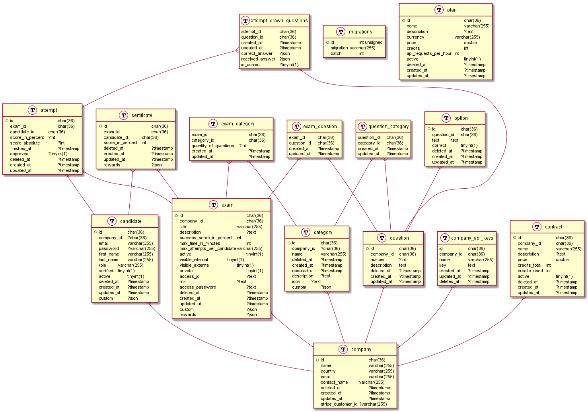

# My Micro certs

With MyMicroCerts we provide to many companies the ability to perform evaluations to their employees using a secure, fast and reliable api.

In this first release we have the following features.
### MyMicroCerts Management Features
- Company management
- Plans management
- Purchases of packages (mymicrocerts usage plans) by Companies using stripe
### Usage for customers (Companies)
- Candidates management
- Questions management
- Api keys management
- Categories management
- Exams management
- Contracts management
- Exam Statistics

## Structure and Relations
The diagram to understand the relation of the objects inside MyMicroCerts

### Entity Relationship Diagram


exemple of questions
```json
{
	"questions": [
		"804644557-804644557-804644557",
		"274313233-274313233-274313233",
		"134600426-134600426-134600426"
	],
	"categories": [
		{"id": "1722258350-1722258350-1722258350", "quantity": 8},
		{"id": "1056008808-1056008808-1056008808", "quantity": 6},
		{"id": "2056308422-2056308422-2056308422", "quantity": 3}
	]
}
```