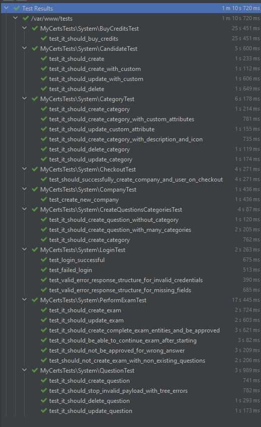

# My Micro certs

With MyMicroCerts we provide to many companies the ability to perform evaluations to their employees using a secure, fast and reliable api.

In this first release we have the following features.
### MyMicroCerts Management Features
- Company management
- Plans management
- Purchases of packages (mymicrocerts usage plans) by Companies using stripe
### Usage for customers (Companies)
- Candidates management
- Questions management
- Api keys management
- Categories management
- Exams management
- Contracts management
- Exam Statistics

## Structure and Relations
The diagram to understand the relation of the objects inside MyMicroCerts

### Entity Relationship Diagram


# Payloads and api examples    

The full api list you can see on the postman collection attached to this project:  
[postman collection json](api.postman_collection.json "postman collection")

POST:/api/question
```json
{
	"description": "{{$randomLoremParagraph}}",
	"categories": [
		"{{category-id}}"
	],
	"options": [
		{
			"text": "true-{{$randomLoremSentence}}",
			"correct": true
		},
		{
			"text": "{{$randomLoremSentence}}"
		},
		{
			"text": "{{$randomLoremSentence}}"
		}
	]
}
```

POST:/api/exam
```json
{
	"company_id": "{{company-id}}",
	"title": "{{$randomJobTitle}}",
	"description": "{{$randomLoremParagraph}}",
	"visible_external": true,
	"password": "123",
	"max_time_in_minutes": {{$randomInt}},
	"success_score_in_percent": 80,
	"questions_per_categories": [
		{
			"category_id": "{{category-id}}",
			"quantity_of_questions": {{$randomLowInt}}
		}
	],
	"fixed_questions": [
		"{{question-id}}"
	] 
}
```

POST:/api/exam/{exam_id}/finish
```json
{
    "candidate_id": "{{candidate-id}}",
    "attempt_id": "{{attempt-id}}",
    "answers": [
        {
            "question_id": "{{question-id}}",
            "selected_option_ids": [
                "ab4906ef-d803-4260-bbb9-964c4383b3c7"
            ]
        },
        {
            "question_id": "335a3484-a049-432f-b069-70bf65f8556e",
            "selected_option_ids": [
                "67b4883d-1cef-497e-ba58-a313042a1604"
            ]
        }
    ]
}
```

# Tests
Full test suit running
